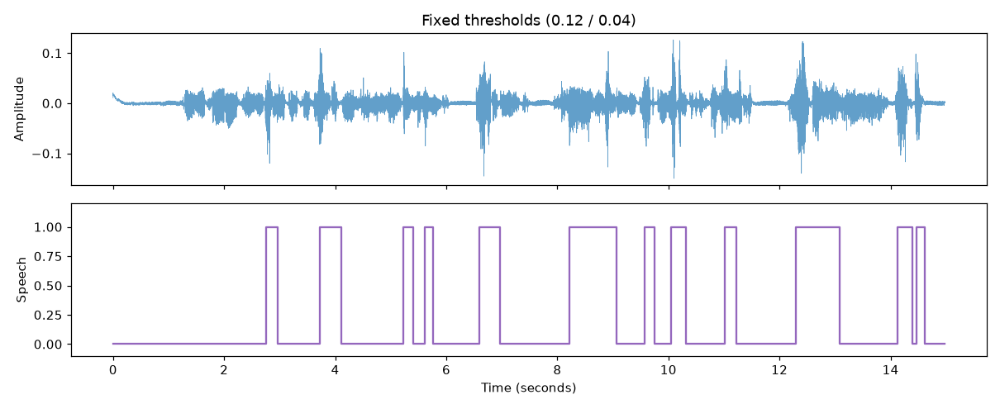
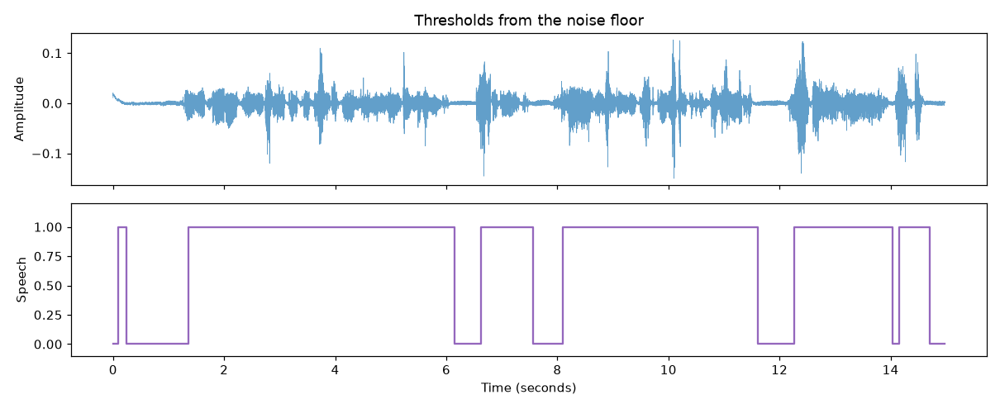

# vad-from-scratch

Voice activity detection from scratch. No libraries that hide the pipeline, just framing, then energy and ZCR.

```
vad-from-scratch/
├── vad/
│   ├── __init__.py
│   ├── framing.py    # frames the audio, runs the speech/silence state machine
│   ├── features.py   # energy and zero-crossing rate
│   ├── segments.py   # turns per-frame flags into timestamps, writes the clips out
│   ├── plotting.py
│   └── cli.py
├── docs/
└── requirements.txt
```

## Running it

```bash
python -m venv venv
source venv/bin/activate
pip install -r requirements.txt
python vad/cli.py your_audio.wav
```

Bring your own wav, the test files aren't in the repo. `--frame-ms` changes the frame size, default is 30.

You get three things: the detected segments printed as timestamps, a `features_preview.png` with the waveform, energy, ZCR and the speech/silence decision stacked on one time axis, and the segments cut out as wavs in `output_segments/` so you can actually listen and check they're speech.

## How it decides

Chop the audio into 30ms frames, get energy and ZCR for each one, then walk through them with a two-threshold state machine.

Thresholds come from the signal, not from constants. The 10th percentile of frame energy is a decent stand-in for the noise floor, so speech starts at 5x that and stops at 2x. Two thresholds instead of one means a frame hovering near the line can't rattle the state back and forth.

Flipping either way needs the signal to hold: 3 frames above the line before it counts as speech starting, 3 below before it counts as stopping. Without that, one loud consonant reads as a whole segment and every pause between words splits one utterance into five. There's also a ZCR gate on onset, since high zero-crossing with high energy is usually noise rather than voice.

## Why the thresholds aren't constants

Both plots below show the same audio file. The top panel is the waveform, so wherever it's fat and busy, someone is talking. The bottom panel is what the detector decided: high means speech, low means silence. If the detector is working, the high parts should line up with the busy parts above them.

This started with `on = 0.12` and `off = 0.04`, two numbers picked by looking at one file's energy plot and guessing.



They don't line up. The waveform is busy almost the whole way from 1.3s to the end, but the detector sits low for most of it and only pops up about a dozen times. Look at 1.3s to 2.8s: clearly speech up top, called silence down below. The bits it does catch are narrow spikes, not the actual span of the words.

The reason is that 0.12 is simply too high for this recording. Most of the speech here has less energy than that. Only sharp consonants get loud enough to cross the line, so the detector triggers on those individual pops and calls the vowels between them silence.



Same file, but now the thresholds are calculated from the audio: take the 10th percentile of frame energy as a stand in for the room noise, then set the on threshold at 5x that and the off threshold at 2x. For this file that works out to 0.0056 and 0.0022, so roughly twenty times lower than the guess.

Now the high sections cover whole stretches of talking instead of single spikes, and the drops to silence happen at 6.2s, 7.5s and 11.6s, which are real pauses you can see as flat spots in the waveform.

The detector didn't get smarter between these two images. The only change is that the line it compares against is now derived from this file instead of hardcoded, which matters because a quiet recording and a loud one need completely different numbers.

It's still not perfect. There's a short false trigger at about 0.2s where the file is actually silent, and the gap at 14.1s looks like it's splitting a word in half rather than catching a pause.

## Notes

These plots come from my own recordings, so the numbers are tuned to what I tested on. Different rooms and mics will want different multipliers.
